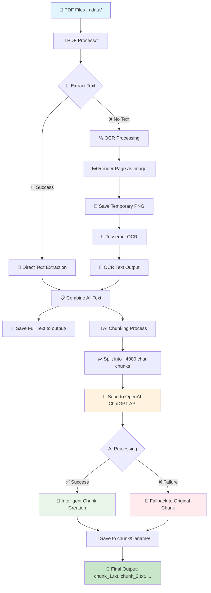
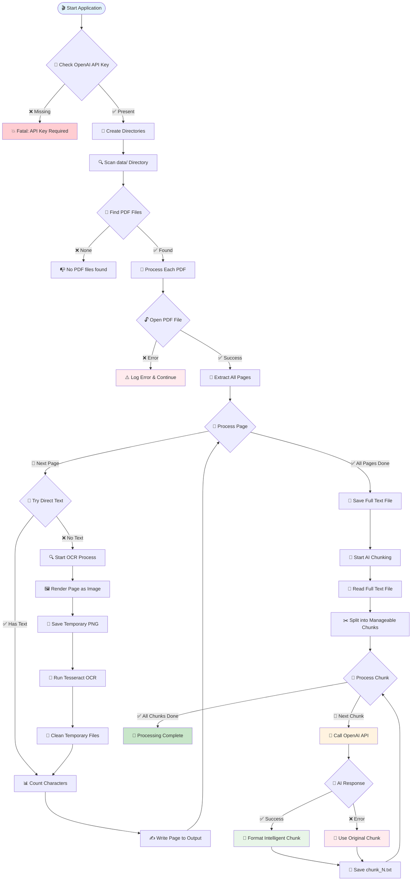
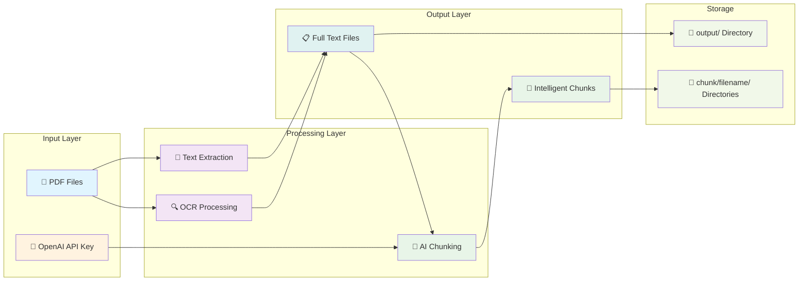
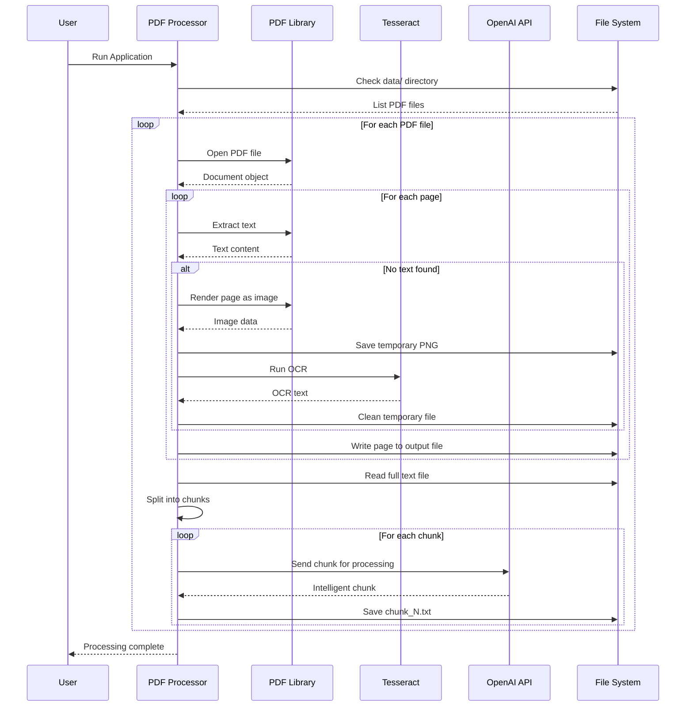
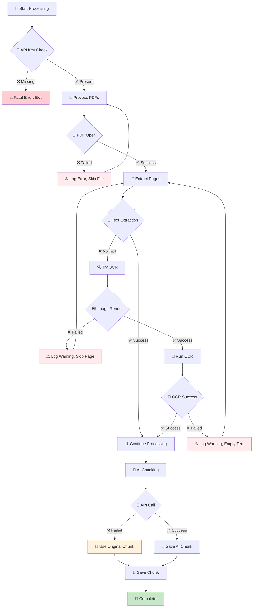

# PDF Chunk Extractor - High Level Flow

## System Architecture Flow

```mermaid
graph TD
    A[📁 PDF Files in data/] --> B[🚀 PDF Processor]
    B --> C{📄 Extract Text}
    
    C -->|✅ Success| D[📝 Direct Text Extraction]
    C -->|❌ No Text| E[🔍 OCR Processing]
    
    E --> F[🖼️ Render Page as Image]
    F --> G[📸 Save Temporary PNG]
    G --> H[🤖 Tesseract OCR]
    H --> I[📄 OCR Text Output]
    
    D --> J[📋 Combine All Text]
    I --> J
    
    J --> K[💾 Save Full Text to output/]
    J --> L[🧠 AI Chunking Process]
    
    L --> M[✂️ Split into ~4000 char chunks]
    M --> N[🤖 Send to OpenAI ChatGPT API]
    
    N --> O{AI Processing}
    O -->|✅ Success| P[📝 Intelligent Chunk Creation]
    O -->|❌ Failure| Q[📄 Fallback to Original Chunk]
    
    P --> R[📁 Save to chunk/filename/]
    Q --> R
    
    R --> S[🎯 Final Output: chunk_1.txt, chunk_2.txt, ...]
    
    style A fill:#e1f5fe
    style S fill:#c8e6c9
    style N fill:#fff3e0
    style P fill:#e8f5e8
    style Q fill:#ffebee
```

## Detailed Process Flow

```mermaid
flowchart TD
    Start([🎬 Start Application]) --> CheckEnv{🔑 Check OpenAI API Key}
    CheckEnv -->|❌ Missing| Error1[💥 Fatal: API Key Required]
    CheckEnv -->|✅ Present| CreateDirs[📁 Create Directories]
    
    CreateDirs --> ScanData[🔍 Scan data/ Directory]
    ScanData --> FindPDFs{📄 Find PDF Files}
    FindPDFs -->|❌ None| NoFiles[📭 No PDF files found]
    FindPDFs -->|✅ Found| ProcessPDF[📄 Process Each PDF]
    
    ProcessPDF --> OpenPDF{🔓 Open PDF File}
    OpenPDF -->|❌ Error| LogError[⚠️ Log Error & Continue]
    OpenPDF -->|✅ Success| ExtractPages[📖 Extract All Pages]
    
    ExtractPages --> PageLoop{📄 Process Page}
    PageLoop -->|🔄 Next Page| TryText{📝 Try Direct Text}
    TryText -->|✅ Has Text| CountChars[📊 Count Characters]
    TryText -->|❌ No Text| OCRProcess[🔍 Start OCR Process]
    
    OCRProcess --> RenderImage[🖼️ Render Page as Image]
    RenderImage --> SaveTemp[💾 Save Temporary PNG]
    SaveTemp --> RunTesseract[🤖 Run Tesseract OCR]
    RunTesseract --> Cleanup[🧹 Clean Temporary Files]
    Cleanup --> CountChars
    
    CountChars --> WritePage[✍️ Write Page to Output]
    WritePage --> PageLoop
    
    PageLoop -->|✅ All Pages Done| SaveFullText[💾 Save Full Text File]
    SaveFullText --> StartChunking[🧠 Start AI Chunking]
    
    StartChunking --> ReadText[📖 Read Full Text File]
    ReadText --> SplitChunks[✂️ Split into Manageable Chunks]
    SplitChunks --> ChunkLoop{🔄 Process Chunk}
    
    ChunkLoop -->|📝 Next Chunk| CallOpenAI[🤖 Call OpenAI API]
    CallOpenAI --> AIResponse{🤖 AI Response}
    AIResponse -->|✅ Success| FormatChunk[📝 Format Intelligent Chunk]
    AIResponse -->|❌ Error| UseOriginal[📄 Use Original Chunk]
    
    FormatChunk --> SaveChunk[💾 Save chunk_N.txt]
    UseOriginal --> SaveChunk
    SaveChunk --> ChunkLoop
    
    ChunkLoop -->|✅ All Chunks Done| Complete[🎉 Processing Complete]
    
    style Start fill:#e3f2fd
    style Complete fill:#c8e6c9
    style Error1 fill:#ffcdd2
    style LogError fill:#ffebee
    style CallOpenAI fill:#fff3e0
    style FormatChunk fill:#e8f5e8
    style UseOriginal fill:#ffebee
```

## Data Flow Diagram

```mermaid
graph LR
    subgraph "Input Layer"
        A[📁 PDF Files]
        B[🔑 OpenAI API Key]
    end
    
    subgraph "Processing Layer"
        C[📄 Text Extraction]
        D[🔍 OCR Processing]
        E[🧠 AI Chunking]
    end
    
    subgraph "Output Layer"
        F[📋 Full Text Files]
        G[📝 Intelligent Chunks]
    end
    
    subgraph "Storage"
        H[📂 output/ Directory]
        I[📂 chunk/filename/ Directories]
    end
    
    A --> C
    A --> D
    B --> E
    C --> F
    D --> F
    F --> E
    E --> G
    F --> H
    G --> I
    
    style A fill:#e1f5fe
    style B fill:#fff3e0
    style C fill:#f3e5f5
    style D fill:#f3e5f5
    style E fill:#e8f5e8
    style F fill:#e0f2f1
    style G fill:#e8f5e8
    style H fill:#f1f8e9
    style I fill:#f1f8e9
```

## Component Interaction

```mermaid
sequenceDiagram
    participant User
    participant App as PDF Processor
    participant PDF as PDF Library
    participant OCR as Tesseract
    participant AI as OpenAI API
    participant FS as File System
    
    User->>App: Run Application
    App->>FS: Check data/ directory
    FS-->>App: List PDF files
    
    loop For each PDF file
        App->>PDF: Open PDF file
        PDF-->>App: Document object
        
        loop For each page
            App->>PDF: Extract text
            PDF-->>App: Text content
            
            alt No text found
                App->>PDF: Render page as image
                PDF-->>App: Image data
                App->>FS: Save temporary PNG
                App->>OCR: Run OCR
                OCR-->>App: OCR text
                App->>FS: Clean temporary file
            end
            
            App->>FS: Write page to output file
        end
        
        App->>FS: Read full text file
        App->>App: Split into chunks
        
        loop For each chunk
            App->>AI: Send chunk for processing
            AI-->>App: Intelligent chunk
            App->>FS: Save chunk_N.txt
        end
    end
    
    App-->>User: Processing complete
```

## Error Handling Flow

```mermaid
graph TD
    A[🚀 Start Processing] --> B{🔑 API Key Check}
    B -->|❌ Missing| C[💥 Fatal Error: Exit]
    B -->|✅ Present| D[📄 Process PDFs]
    
    D --> E{📄 PDF Open}
    E -->|❌ Failed| F[⚠️ Log Error, Skip File]
    E -->|✅ Success| G[📖 Extract Pages]
    
    G --> H{📝 Text Extraction}
    H -->|❌ No Text| I[🔍 Try OCR]
    H -->|✅ Success| J[📊 Continue Processing]
    
    I --> K{🖼️ Image Render}
    K -->|❌ Failed| L[⚠️ Log Warning, Skip Page]
    K -->|✅ Success| M[🤖 Run OCR]
    
    M --> N{🤖 OCR Success}
    N -->|❌ Failed| O[⚠️ Log Warning, Empty Text]
    N -->|✅ Success| J
    
    J --> P[🧠 AI Chunking]
    P --> Q{🤖 API Call}
    Q -->|❌ Failed| R[📄 Use Original Chunk]
    Q -->|✅ Success| S[📝 Save AI Chunk]
    
    R --> T[💾 Save Chunk]
    S --> T
    T --> U[🎉 Complete]
    
    F --> D
    L --> G
    O --> G
    
    style C fill:#ffcdd2
    style F fill:#ffebee
    style L fill:#ffebee
    style O fill:#ffebee
    style R fill:#fff3e0
    style U fill:#c8e6c9
``` 