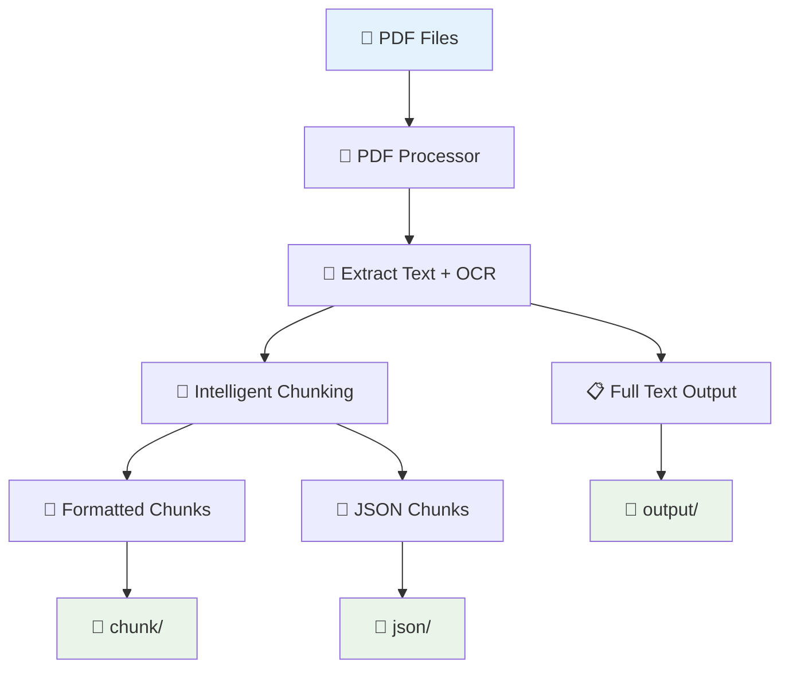
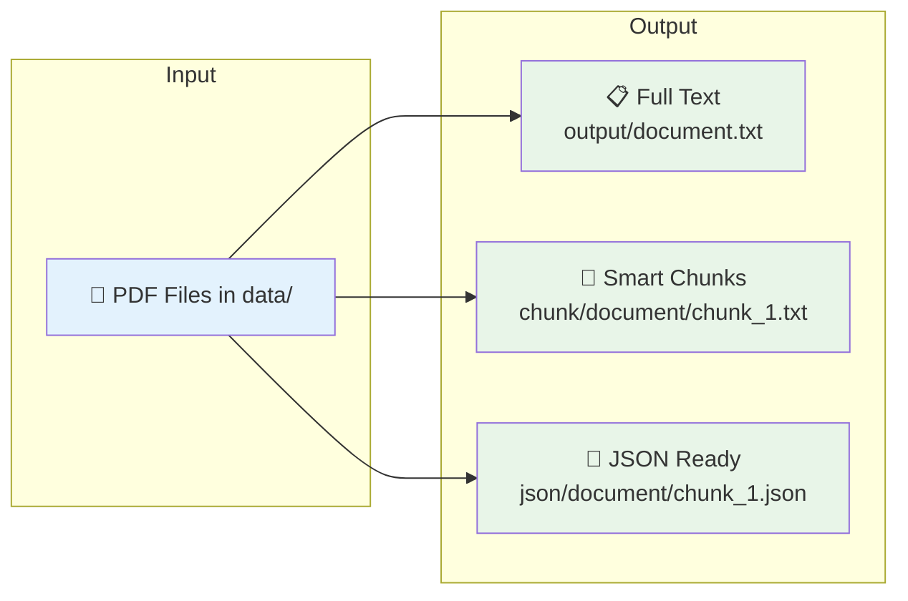
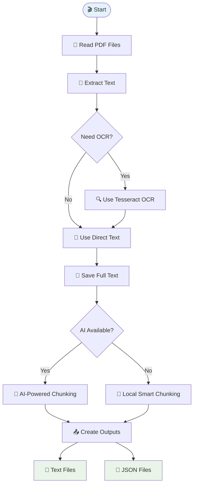
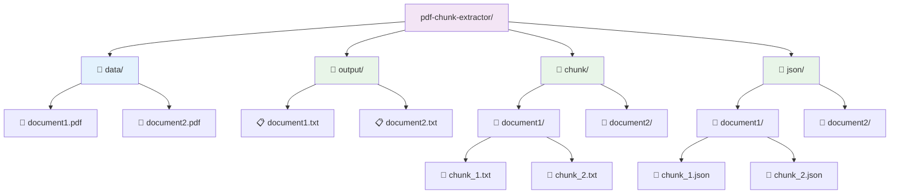
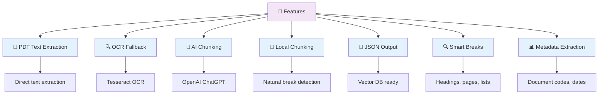

# PDF Chunk Extractor - High Level Overview

## 🎯 Simple Process Flow



## 📊 What You Get



## 🔄 Processing Steps



## 📁 Directory Structure



## 🎯 Output Examples

### 📋 Full Text Output
```
--- Page 3 ---
Panen Kelapa Sawit
SOP/KCN-AGR/012/2023
Tujuan
1. Memastikan seluruh Tandan Buah Segar (TBS)...
```

### 📝 Smart Chunk Output
```
# Document Chunk

## Metadata
- **Chunk Number**: 1 of 3
- **Page Range**: Page 3–4
- **Document Code**: SOP/KCN-AGR/012/2023

## Content

### Panen Kelapa Sawit

### Tujuan

1. Memastikan seluruh Tandan Buah Segar (TBS)...
```

### 📄 JSON Output
```json
{
  "filename": "document.pdf",
  "chunk_index": 1,
  "page_range": "Page 3–4",
  "text": "### Panen Kelapa Sawit\n\n### Tujuan\n\n1. Memastikan seluruh Tandan Buah Segar (TBS)..."
}
```

## 🚀 How to Use


## 🎨 Features



## 🎉 Benefits

- **🔄 Dual Mode**: Works with or without AI
- **📊 Rich Output**: Text, chunks, and JSON
- **🔍 Smart Processing**: Respects document structure
- **📄 Vector Ready**: JSON perfect for databases
- **🎯 Easy to Use**: Simple command line interface
- **🛡️ Robust**: Handles errors gracefully 